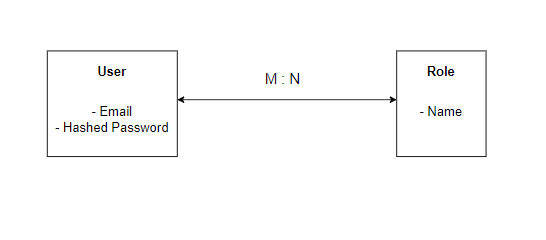
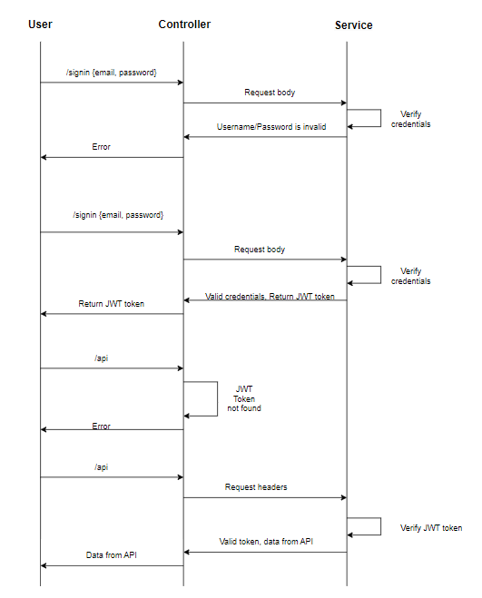
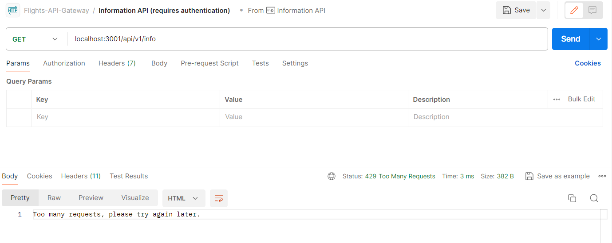
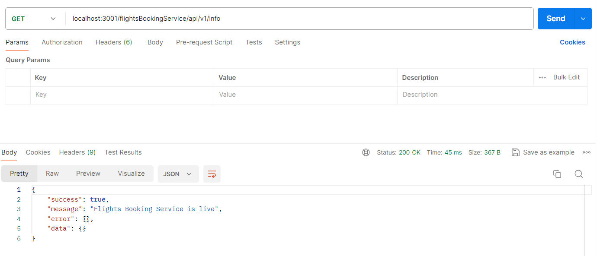
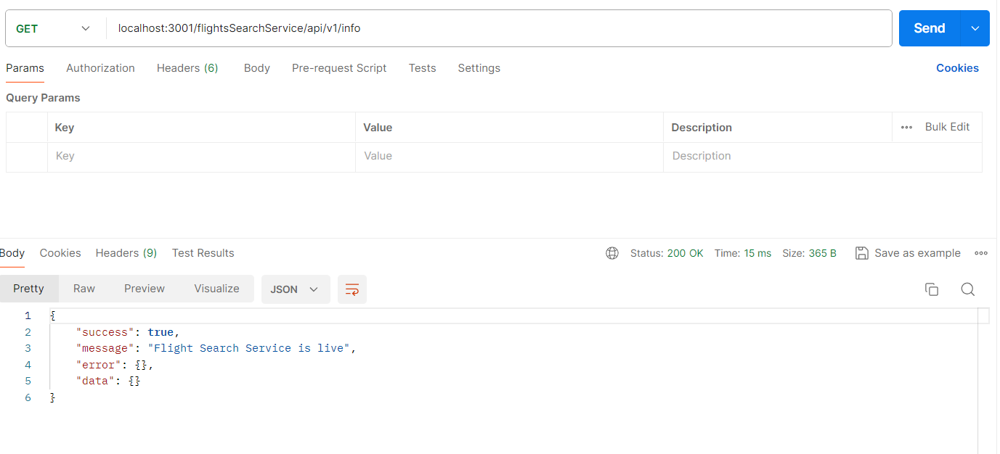
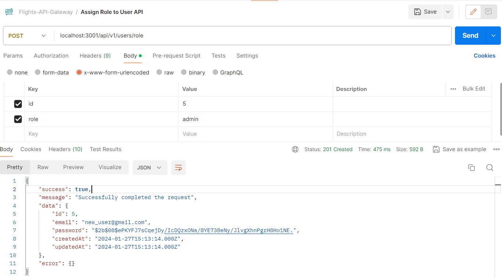
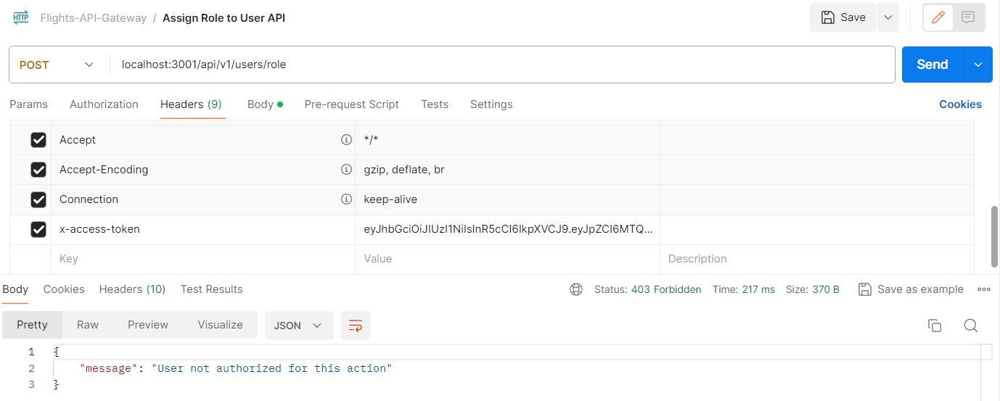

# Flight Ticket Booking API Gateway

<h3>Introduction to the API Gateway Service</h3>

    Flight Ticket Booking API Gateway Service is a Node.js-based microservice that acts as a single entry point for various services in the flight ticket booking system. This service facilitates user registration, authentication, and routing requests to the appropriate microservices while implementing essential features such as JWT token authentication, rate limiting, and reverse proxy

<h3>High Level Design of Project</h3>

<h3>Features of the API Gateway Service</h3>

<ol>
<li>
<b>User Registration and Sign Up:</b> Implemented APIs for user registration and sign-up using JWT tokens for secure authentication and bcrypt for storing passwords securely.
</li>
<li>
<b>Rate Limiter:</b>Integrated rate limiting functionality to limit the number of requests made to the API to prevent abuse and ensure fair usage.
</li>
<li>
<b>Reverse Proxy:</b>Configured a reverse proxy to enable access to multiple services through a single gateway, providing a streamlined experience for clients.
</li>
</ol>

**Schema of this service**

**Sequence Diagram for Sign in functionality**

**High level overview of this service**

We use bcrypt js package in order to hash the password before saving to the User table. 

We leverage triggers (known as hooks in Sequelize), to compute the hash of the password before inserting the record into the table.

The package 'npm-express-limit' helps us to ensure rate limiting. Rate limiting allows us to set a limit on the maximum number of requests than can be made from an IP in a specific window of time.

In this project, we use the 'http-proxy-middleware' package in order to implement API routing a.k.a reverse proxy.

In order to implement authorization mechanisms in our project, we implement a Roles table where we define the role of each user w.r.t our system (like IT Admin, Airplane Company, Customer). We identify a many to many relationship between the 'Users' and 'Roles' tables, and hence we need to setup a through table. This through table is a Users_Role table, and the User ID and Role Name is together used as a composite key.

Some of the snapshots from this service are:

1. Rate limiting in action

2. Flights Booking Service being routed by the reverse proxy

3. Flights Search Service being routed by the reverse proxy

4. Assign (Add) role API working correctly when the user making the request is an admin:

5. Assign (Add) role API not working correctly when the user making the request is not an admin:

